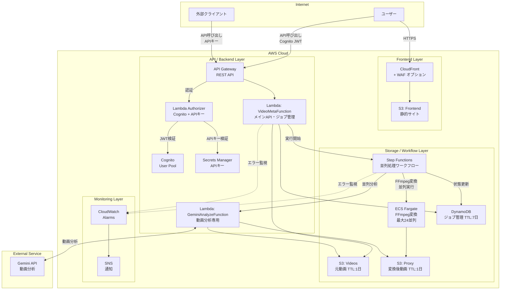
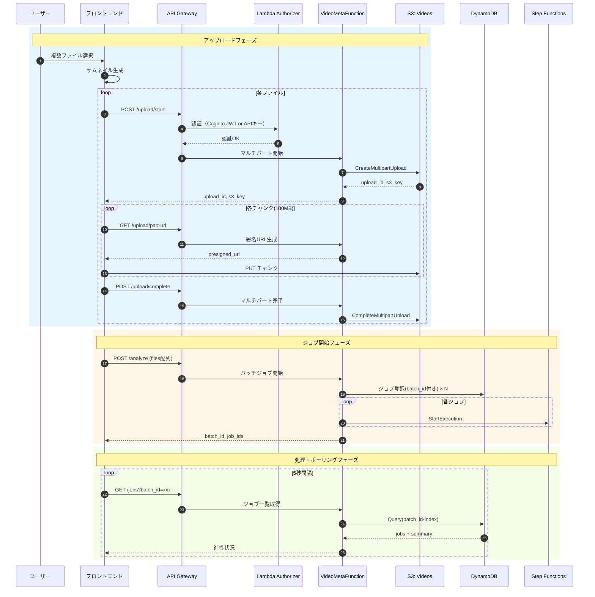
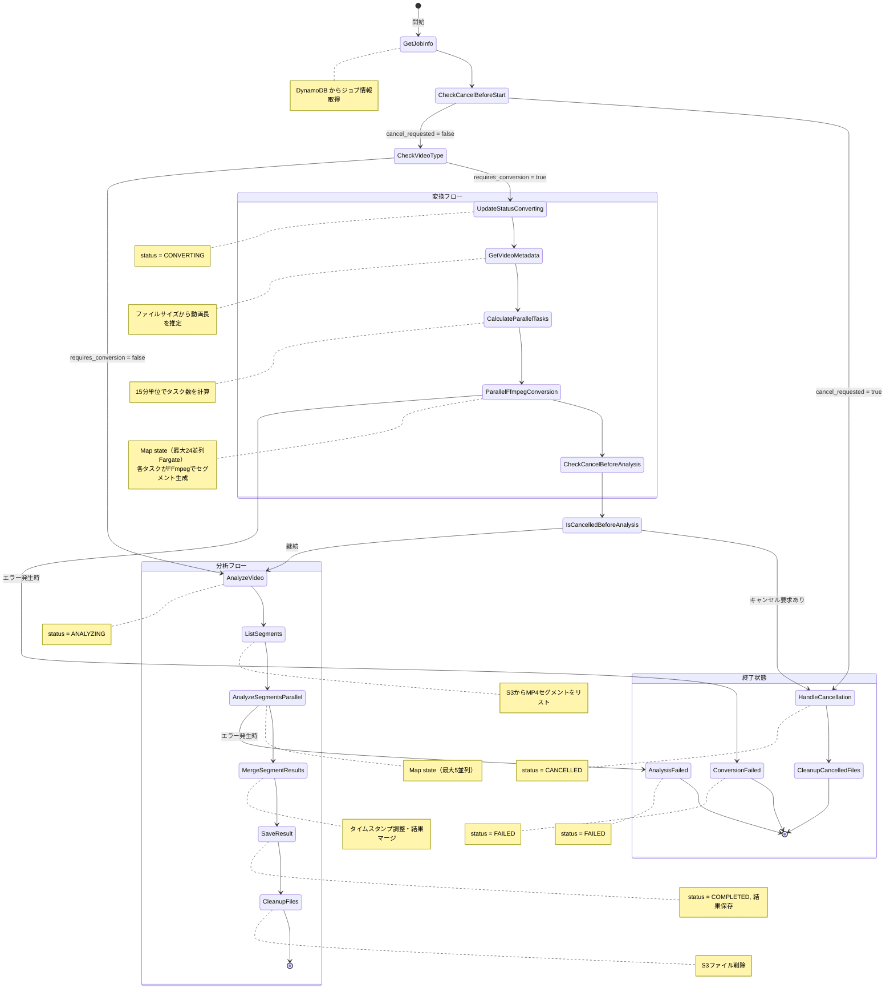

# システム設計書

> **更新日**: 2025-12-30
> **対象ブランチ**: `feature/infra-change`

## 1. システム構成

### 1.1 全体アーキテクチャ



### 1.2 処理分岐

| 条件 | 処理方式 | 変換 | セグメント分割 |
|------|---------|------|---------------|
| MP4かつ2GB以下 | 非同期処理 | なし | なし |
| MP4かつ2GB超 | 非同期処理 | FFmpeg変換あり | あり（15分単位） |
| MXF（全サイズ） | 非同期処理 | FFmpeg変換あり | あり（15分単位） |

### 1.3 長時間動画対応

| 項目 | 値 |
|------|-----|
| セグメント長 | 15分（900秒） |
| 最大対応時間 | 23時間59分 |
| 最大セグメント数 | 96（24時間 / 15分） |
| 並列FFmpeg変換数 | 最大24並列 |
| 並列Gemini分析数 | 最大5並列 |

---

## 2. 処理フロー

### 2.1 複数動画バッチ処理



### 2.2 Step Functions ワークフロー（Fargate FFmpeg対応版）



---

## 3. API仕様

### 3.1 認証方式

| 方式 | ヘッダー | 用途 |
|------|---------|------|
| Cognito JWT | `Authorization: Bearer <token>` | フロントエンドUI |
| APIキー | `x-api-key: <key>` | 外部システム連携 |

### 3.2 エンドポイント一覧

| パス | メソッド | 認証 | 説明 |
|------|---------|------|------|
| `/upload/start` | POST | 要 | マルチパートアップロード開始 |
| `/upload/part-url` | GET | 要 | パート用署名付きURL取得 |
| `/upload/complete` | POST | 要 | マルチパートアップロード完了 |
| `/analyze` | POST | 要 | ジョブ開始（バッチ/同期自動判定） |
| `/jobs` | GET | 要 | ジョブ一覧取得 |
| `/jobs` | POST | 要 | 単一ジョブ開始 |
| `/jobs/{job_id}` | GET | 要 | ジョブ詳細取得 |
| `/jobs/{job_id}` | DELETE | 要 | ジョブキャンセル |

### 3.3 主要APIの詳細

#### POST /analyze（バッチジョブ開始）

```json
// Request
{
  "files": [
    {
      "s3_key": "uploads/uuid/video.mp4",
      "file_size": 1073741824,
      "content_type": "video/mp4",
      "original_filename": "video.mp4"
    }
  ]
}

// Response
{
  "batch_id": "batch-uuid",
  "jobs": [
    {"job_id": "job-uuid", "original_filename": "video.mp4", "queue_position": 0}
  ],
  "total_jobs": 1
}
```

### 3.4 ジョブ状態

| ステータス | 説明 |
|-----------|------|
| `PENDING` | 処理待機中 |
| `QUEUED` | キュー登録済み |
| `CONVERTING` | MediaConvert変換中 |
| `ANALYZING` | Gemini分析中 |
| `COMPLETED` | 完了 |
| `FAILED` | エラー |
| `CANCELLED` | キャンセル済み |

---

## 4. インフラ構成

### 4.1 AWSリソース

| リソース | 用途 | 設定 |
|---------|------|------|
| CloudFront | フロントエンド配信 | OAC、HTTPS |
| WAF | セキュリティ（オプション） | レート制限、Managed Rules |
| S3 (Frontend) | 静的ファイル | プライベート |
| S3 (Videos) | 元動画一時保存 | TTL: 1日 |
| S3 (Proxy) | プロキシ動画一時保存 | TTL: 1日 |
| API Gateway | REST API | Lambda Authorizer |
| Lambda Authorizer | 認証 | Cognito JWT + APIキー |
| Lambda (VideoMeta) | バックエンド | コンテナイメージ、15分タイムアウト |
| Lambda (GeminiAnalyze) | 動画分析 | コンテナイメージ、15分タイムアウト、EphemeralStorage 2GB |
| Cognito | 認証 | User Pool、Hosted UI、AdminCreateUserOnly |
| Secrets Manager | APIキー | 64文字ランダム生成 |
| DynamoDB | ジョブ管理 | TTL: 7日、GSI: batch_id |
| Step Functions | ワークフロー | Map state並列処理 |
| ECS Fargate | FFmpeg変換 | 4vCPU, 8GB RAM, 200GB ephemeral, 最大24並列 |
| ECR | コンテナイメージ | Lambda用 + FFmpeg用 |

### 4.2 DynamoDBスキーマ

```
job_id (PK)
batch_id (GSI PK)
queue_position (GSI SK)
original_filename
s3_key
file_size
content_type
requires_conversion
status
cancel_requested
execution_arn
created_at
completed_at
mediaconvert_job_ids (JSON文字列)  # 複数ジョブID
proxy_prefix                       # セグメントファイルのプレフィックス
num_segments                       # セグメント数
result
error_message
ttl
```

### 4.3 プロキシ動画設定（FFmpeg）

| 設定 | 値 |
|------|-----|
| 解像度 | 640x360 |
| フレームレート | 1fps |
| ビットレート | 500kbps |
| コーデック | H.264 |
| コンテナ | MP4 |
| 音声 | AAC 64kbps |
| セグメント単位 | 15分（900秒） |

---

## 5. フロントエンド構成

### 5.1 ファイル構成

| ファイル | 内容 |
|---------|------|
| `index.html` | メインページ |
| `config.js` | 環境設定（API URL、Cognito設定） |
| `js/app.js` | アプリケーションロジック |
| `css/style.css` | スタイルシート |

### 5.2 主要機能

| 機能 | 説明 |
|------|------|
| Cognito認証 | Hosted UIでログイン |
| 複数ファイル選択 | ドラッグ&ドロップ対応 |
| サムネイル生成 | 動画から自動生成 |
| マルチパートアップロード | 100MBチャンク分割 |
| 進捗表示 | 各ファイル + 全体プログレス |
| キャンセル機能 | 個別/全体キャンセル |
| ダウンロード | 個別CSV + ZIP一括 |

### 5.3 制限値

| 項目 | 値 |
|------|-----|
| 最大同時ファイル数 | 50ファイル |
| 最大ファイルサイズ | 100GB/ファイル |
| 並列処理数 | 5本 |

---

## 6. フォルダ構成

```
tvs-videometa-api/
├── backend/
│   └── src/videometa/
│       ├── handler.py         # Lambdaハンドラー
│       ├── config.py          # 設定管理
│       ├── services/
│       │   └── gemini_client.py
│       ├── models/
│       │   ├── metadata.py
│       │   └── errors.py
│       ├── parsers/
│       │   └── markdown_parser.py
│       └── prompts/
│           ├── video_analysis.py
│           ├── format_correction.py
│           ├── context_analysis.py
│           └── program_summarize.py
├── frontend/
│   ├── index.html
│   ├── config.js
│   ├── config.js.example
│   ├── css/style.css
│   └── js/app.js
├── tests/
│   └── parsers/
│       └── test_markdown_parser.py
├── infra/
│   ├── template.yaml
│   ├── waf-template.yaml
│   ├── samconfig.toml
│   ├── authorizer/
│   │   ├── index.py           # Lambda Authorizer（Cognito JWT + APIキー認証）
│   │   └── requirements.txt   # PyJWT依存
│   ├── ffmpeg-converter/
│   │   ├── Dockerfile
│   │   └── convert.py
│   └── statemachine/
│       └── video-processing.asl.json
├── docs/
├── Dockerfile
├── pyproject.toml
└── README.md
```
