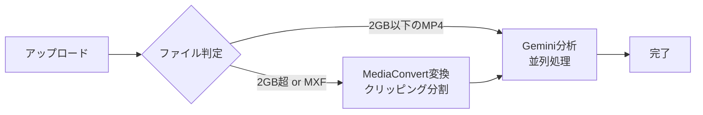

# 動画処理時間見積もり

> **更新日**: 2025-12-20
> **対象ブランチ**: `aws-deploy-multiple-csv`

本ドキュメントでは、動画メタデータ自動生成サービスにおける処理時間の見積もり方法を記載します。

## 処理フロー概要



### 処理分岐条件

| 条件 | 処理フロー |
|------|-----------|
| MP4かつ2GB以下 | アップロード → Gemini分析（直接） |
| MP4かつ2GB超 | アップロード → MediaConvert変換（クリッピング分割） → Gemini並列分析 |
| MXF（全サイズ） | アップロード → MediaConvert変換（クリッピング分割） → Gemini並列分析 |

### 長時間動画対応

| 項目 | デフォルト値 | 最大値（要AWS Quotas増） |
|------|-------------|------------------------|
| セグメント長 | 1.5時間（5400秒） | - |
| 最大対応時間 | 15時間 | 23時間59分 |
| 最大セグメント数 | 10 | 16 |
| 並列分析数 | 最大5並列 | - |

**注意**: デフォルトでは1動画あたり最大10個のMediaConvertジョブに制限されています。
23時間59分までの動画を処理するには、AWS Service QuotasでMediaConvertの同時ジョブ数を増やし、
環境変数 `VIDEOMETA_MAX_MEDIACONVERT_JOBS_PER_VIDEO=16` を設定してください。

## 各ステップの時間計算

### 1. アップロード時間

```
アップロード時間(秒) = ファイルサイズ(MB) / アップロード速度(MB/s)
```

| 回線速度 | 1GB動画 | 10GB動画 | 50GB動画 |
|---------|--------|---------|---------|
| 10Mbps | 約14分 | 約2.3時間 | 約11時間 |
| 100Mbps | 約1.4分 | 約14分 | 約1.1時間 |
| 1Gbps | 約8秒 | 約1.4分 | 約7分 |

### 2. MediaConvert変換時間

MXFファイルまたは2GB超の動画ファイルのみ適用されます。

```
変換時間 ≈ 動画の長さ × 変換係数
```

| 元動画品質 | 変換係数 | 10分動画 | 60分動画 |
|-----------|---------|---------|---------|
| SD (720×480) | 0.3〜0.5x | 3〜5分 | 18〜30分 |
| HD (1920×1080) | 0.5〜1.0x | 5〜10分 | 30〜60分 |
| 4K (3840×2160) | 1.0〜2.0x | 10〜20分 | 60〜120分 |
| 放送用MXF | 0.5〜1.5x | 5〜15分 | 30〜90分 |

**補足**: プロキシ出力設定（640×360, 1fps, 500kbps）のため、高解像度エンコードより高速です。

### 3. Gemini API分析時間

```
分析時間 ≈ ファイルアップロード待機 + AI処理時間
```

#### 単一セグメントの分析時間

| プロキシ動画長 | ファイルサイズ目安 | アップロード+待機 | 分析処理 | 合計 |
|--------------|------------------|-----------------|---------|------|
| 10分 | 約4MB | 10〜30秒 | 1〜3分 | 約2〜4分 |
| 30分 | 約12MB | 20〜60秒 | 3〜8分 | 約4〜10分 |
| 60分 | 約23MB | 30〜90秒 | 5〜15分 | 約6〜17分 |
| 90分（1セグメント上限） | 約34MB | 45〜90秒 | 8〜20分 | 約10〜22分 |

**プロキシ動画サイズ計算**: 640×360, 1fps, 500kbps ≈ 約60KB/秒 ≈ 約3.6MB/分

#### 並列分析による時間短縮

長時間動画は1.5時間単位でセグメント分割され、最大5並列で分析されます。

| 元動画長 | セグメント数 | 並列バッチ数 | 実効分析時間 |
|---------|------------|------------|------------|
| 1.5時間以下 | 1 | 1 | 約10〜22分 |
| 3時間 | 2 | 1 | 約10〜22分（並列） |
| 7.5時間 | 5 | 1 | 約10〜22分（並列） |
| 15時間 | 10 | 2 | 約20〜44分 |
| 23時間59分 | 16 | 4 | 約40〜88分 |

**計算式**: 実効分析時間 ≈ ceil(セグメント数 / 5) × 単一セグメント分析時間

## 総合見積もり

### 計算式

```
総処理時間 = アップロード時間 + (変換時間 × 変換必要フラグ) + Gemini分析時間
```

### シナリオ別見積もり（100Mbps回線想定）

| シナリオ | ファイルサイズ/長さ | アップロード | 変換 | 分析 | **合計** |
|---------|-------------------|------------|------|------|---------|
| 小規模MP4 | 500MB / 10分 | 40秒 | なし | 3分 | **約4分** |
| 中規模MP4 | 2GB / 30分 | 2.5分 | なし | 8分 | **約11分** |
| 大規模MP4 | 10GB / 60分 | 14分 | 45分 | 15分 | **約74分** |
| 放送用MXF | 50GB / 60分 | 70分 | 45分 | 15分 | **約130分** |
| 4K MXF | 100GB / 60分 | 140分 | 90分 | 15分 | **約4時間** |

### 長時間動画シナリオ（100Mbps回線想定）

| シナリオ | ファイルサイズ/長さ | アップロード | 変換 | 分析（並列） | **合計** |
|---------|-------------------|------------|------|------------|---------|
| 長時間MXF | 100GB / 3時間 | 140分 | 90分 | 20分（2並列） | **約4時間** |
| 終日収録MXF | 200GB / 8時間 | 280分 | 240分 | 40分（6セグ/5並列） | **約9時間** |
| 24時間MXF | 400GB / 23時間59分 | 560分 | 720分 | 80分（16セグ/5並列） | **約23時間** |

**備考**: 長時間動画では変換とアップロードがボトルネックとなり、並列分析により分析時間は大幅に短縮されます。

## 簡易計算式（概算用）

以下の式で大まかな処理時間を概算できます。

```
処理時間(分) ≈ ファイルサイズ(GB) × 回線係数 + 動画長(分) × 画質係数 + 動画長(分) × 0.25
```

### 係数一覧

**回線係数**（100Mbps基準）

| 回線速度 | 係数 |
|---------|------|
| 10Mbps | 15.0 |
| 100Mbps | 1.5 |
| 1Gbps | 0.15 |

**画質係数**（MediaConvert変換用）

| 元動画品質 | 係数 | 備考 |
|-----------|------|------|
| 2GB以下MP4 | 0 | 変換スキップ |
| SD (720×480) | 0.3 | |
| HD (1920×1080) | 0.7 | |
| 4K (3840×2160) | 1.5 | |
| 放送用MXF | 0.8 | |

### 計算例

**例1: 2GB / 30分のHD MP4（100Mbps回線）**
```
処理時間 = 2 × 1.5 + 30 × 0 + 30 × 0.25 = 3 + 0 + 7.5 = 約11分
```

**例2: 50GB / 60分の放送用MXF（100Mbps回線）**
```
処理時間 = 50 × 1.5 + 60 × 0.8 + 60 × 0.25 = 75 + 48 + 15 = 約138分
```

## システム制限値

| 項目 | 値 | 備考 |
|------|-----|------|
| 直接分析可能サイズ | 2GB | これ以下のMP4は変換なしで分析 |
| Gemini File API上限 | 2GB | プロキシ変換で回避 |
| Lambda タイムアウト | 900秒（15分） | 分析処理用 |
| リクエストタイムアウト | 1200秒（20分） | Gemini API呼び出し |
| S3署名付きURL有効期限 | 3600秒（1時間） | アップロード用 |
| セグメント長 | 5400秒（1.5時間） | クリッピング分割単位 |
| 最大対応動画長（デフォルト） | 54000秒（15時間） | 10セグメント × 1.5時間 |
| 最大対応動画長（最大） | 86340秒（23時間59分） | AWS Quotas増で対応 |
| 1動画あたりMediaConvertジョブ数 | 10（デフォルト） | 環境変数で変更可 |
| 並列分析数 | 5 | Step Functions Map state |

## プロキシ動画設定

MediaConvertで生成されるプロキシ動画の設定：

| 項目 | 値 |
|------|-----|
| 解像度 | 640×360 |
| フレームレート | 1fps |
| ビットレート | 500kbps |
| コーデック | H.264 |
| コンテナ | MP4 |
| 分割方式 | InputClippings（1.5時間単位） |
| 音声 | AAC 64kbps |

## 注意事項

1. **MediaConvert処理時間の変動**: AWSのキューイング状況により、実際の処理時間は変動します
2. **Gemini APIレスポンス時間の変動**: サーバー負荷により、分析時間は変動します
3. **ネットワーク環境**: 多くの場合、アップロード時間が最大のボトルネックになります
4. **大容量ファイル**: マルチパートアップロードを使用するため、一時的なネットワーク切断に対して耐性があります
5. **長時間動画の並列分析**: 最大5並列で分析を実行するため、セグメント数が多くても分析時間は大幅に短縮されます
6. **StartTimecode超過**: 推定動画長より実際が短い場合、後半セグメントは自動スキップされます
