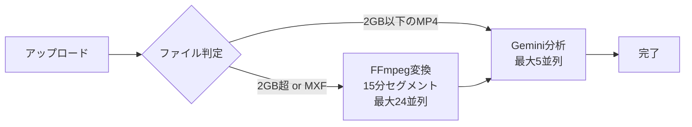

# 動画処理時間見積もり

> **更新日**: 2025-12-30
> **対象ブランチ**: `feature/infra-change`

本ドキュメントでは、動画メタデータ自動生成サービスにおける処理時間の見積もり方法を記載します。

## 処理フロー概要



### 処理分岐条件

| 条件 | 処理フロー |
|------|-----------|
| MP4かつ2GB以下 | アップロード → Gemini分析（直接） |
| MP4かつ2GB超 | アップロード → FFmpeg変換（15分セグメント並列） → Gemini並列分析 |
| MXF（全サイズ） | アップロード → FFmpeg変換（15分セグメント並列） → Gemini並列分析 |

### 長時間動画対応

| 項目 | 値 |
|------|-----|
| セグメント長 | 15分（900秒） |
| 最大対応時間 | 23時間59分 |
| 最大セグメント数 | 96（24時間 / 15分） |
| 並列FFmpeg変換数 | 最大24並列 |
| 並列Gemini分析数 | 最大5並列 |

## 各ステップの時間計算

### 1. アップロード時間

```
アップロード時間(秒) = ファイルサイズ(MB) / アップロード速度(MB/s)
```

| 回線速度 | 1GB動画 | 10GB動画 | 50GB動画 |
|---------|--------|---------|---------|
| 10Mbps | 約14分 | 約2.3時間 | 約11時間 |
| 100Mbps | 約1.4分 | 約14分 | 約1.1時間 |
| 1Gbps | 約8秒 | 約1.4分 | 約7分 |

### 2. FFmpeg変換時間（Fargate並列処理）

MXFファイルまたは2GB超の動画ファイルに適用されます。

#### 単一セグメント（15分）の変換時間

| 元動画品質 | 変換時間目安 |
|-----------|------------|
| SD (720×480) | 30秒〜1分 |
| HD (1920×1080) | 1〜2分 |
| 4K (3840×2160) | 2〜4分 |
| 放送用MXF | 1〜3分 |

**補足**: プロキシ出力設定（640×360, 1fps, 500kbps）のため、高速に変換できます。

#### 並列処理による時間短縮

最大24並列でFargateタスクを実行するため、長時間動画でも変換時間は大幅に短縮されます。

| 元動画長 | セグメント数 | 並列バッチ数 | 実効変換時間（HD想定） |
|---------|------------|------------|---------------------|
| 30分 | 2 | 1 | 約2分（2並列） |
| 1時間 | 4 | 1 | 約2分（4並列） |
| 3時間 | 12 | 1 | 約2分（12並列） |
| 6時間 | 24 | 1 | 約2分（24並列） |
| 12時間 | 48 | 2 | 約4分（24並列×2バッチ） |
| 24時間 | 96 | 4 | 約8分（24並列×4バッチ） |

### 3. Gemini API分析時間

```
分析時間 ≈ ファイルアップロード待機 + AI処理時間
```

#### 単一セグメント（15分）の分析時間

| プロキシ動画長 | ファイルサイズ目安 | 分析時間 |
|--------------|------------------|---------|
| 15分 | 約6MB | 約1〜3分 |

#### 並列分析による時間短縮

最大5並列でGemini分析を実行します。

| 元動画長 | セグメント数 | 並列バッチ数 | 実効分析時間 |
|---------|------------|------------|------------|
| 30分 | 2 | 1 | 約2〜3分（2並列） |
| 1時間 | 4 | 1 | 約2〜3分（4並列） |
| 2時間 | 8 | 2 | 約4〜6分（5並列×2バッチ） |
| 6時間 | 24 | 5 | 約10〜15分（5並列×5バッチ） |
| 24時間 | 96 | 20 | 約40〜60分（5並列×20バッチ） |

**計算式**: 実効分析時間 ≈ ceil(セグメント数 / 5) × 単一セグメント分析時間

## 総合見積もり

### シナリオ別見積もり（100Mbps回線想定）

| シナリオ | ファイルサイズ/長さ | アップロード | FFmpeg変換 | Gemini分析 | **合計** |
|---------|-------------------|------------|-----------|----------|---------|
| 小規模MP4 | 500MB / 10分 | 40秒 | なし | 2分 | **約3分** |
| 中規模MP4 | 2GB / 30分 | 2.5分 | なし | 3分 | **約6分** |
| 大規模MP4 | 10GB / 60分 | 14分 | 2分 | 3分 | **約19分** |
| 放送用MXF | 50GB / 60分 | 70分 | 2分 | 3分 | **約75分** |
| 長時間MXF | 100GB / 3時間 | 140分 | 2分 | 4分 | **約146分** |

### 従来（MediaConvert）との比較

| 項目 | 従来（MediaConvert） | 現在（Fargate + FFmpeg） |
|------|---------------------|------------------------|
| 変換方式 | 順次処理 | **最大24並列** |
| 60分動画の変換時間 | 30〜60分 | **約2分** |
| 3時間動画の変換時間 | 90〜180分 | **約2分** |
| コスト | 従量課金（分単位） | **時間ベース（大幅削減）** |

## システム制限値

| 項目 | 値 | 備考 |
|------|-----|------|
| 直接分析可能サイズ | 2GB | これ以下のMP4は変換なしで分析 |
| Gemini File API上限 | 2GB | プロキシ変換で回避 |
| Lambda タイムアウト | 900秒（15分） | 分析処理用 |
| リクエストタイムアウト | 1200秒（20分） | Gemini API呼び出し |
| S3署名付きURL有効期限 | 3600秒（1時間） | アップロード用 |
| セグメント長 | 900秒（15分） | FFmpeg分割単位 |
| 最大対応動画長 | 86340秒（23時間59分） | |
| 並列FFmpeg変換数 | 24 | Fargate Map state |
| 並列Gemini分析数 | 5 | Step Functions Map state |

## プロキシ動画設定（FFmpeg）

| 項目 | 値 |
|------|-----|
| 解像度 | 640×360 |
| フレームレート | 1fps |
| ビットレート | 500kbps |
| コーデック | H.264 |
| コンテナ | MP4 |
| セグメント単位 | 15分（900秒） |
| 音声 | AAC 64kbps |

## 注意事項

1. **FFmpeg処理時間の変動**: Fargateのコールドスタートにより、初回は若干遅くなる場合があります
2. **Gemini APIレスポンス時間の変動**: サーバー負荷により、分析時間は変動します
3. **ネットワーク環境**: 多くの場合、アップロード時間が最大のボトルネックになります
4. **大容量ファイル**: マルチパートアップロードを使用するため、一時的なネットワーク切断に対して耐性があります
5. **並列処理の効果**: FFmpeg変換は最大24並列、Gemini分析は最大5並列で実行されるため、長時間動画でも処理時間は大幅に短縮されます
